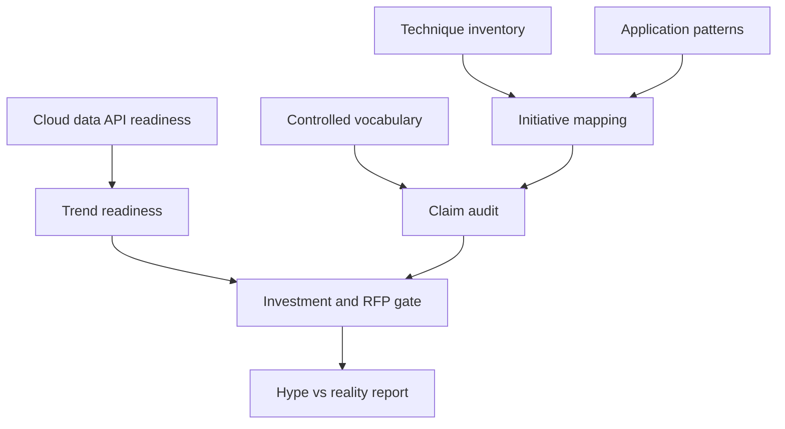

# Lexara

**Source:** `ai-in-enterprise/deloitte-nl-data-analytics-artificial-intelligence-whitepaper-eng/`
**Domain:** `ai-enterprise`
**One-liner:** An enterprise AI claim-and-technique governance catalog that separates hype from reality — defining AI, ML, and cognitive analytics precisely, mapping techniques to applications, and scoring readiness against the five leapfrog trends (cloud, big data, APIs, and related accelerators) before budget is spent.
**Wedge:** Data & analytics leaders in Northern European mid-to-large enterprises (Netherlands and peers) facing vendor rebrands of old “data mining” as “AI” and needing a shared vocabulary plus technique-to-use-case map for investment committees.
**Positioning:** AI literacy and claim audit for buyers. Distinct from Twinlane (analytics runtime lanes), Situara (situational actioning), Adoptra (adoption journey), and Triara (early-adopter risk/talent portfolio). Lexara attacks the source’s core problem: AI is poorly defined, vendors rebrand existing solutions into the hype cycle, and inflated expectations follow — while real techniques (supervised/unsupervised/reinforcement learning, NLP, neural nets) and leapfrog trends (cloud AaaS, unstructured big data, APIs, etc.) actually determine what is buildable.

## Market research synthesis

### Thesis from source

Deloitte Netherlands’ Artificial Intelligence whitepaper series opens by placing AI “at the top of its Hype curve,” exciting and scary in equal measure, while noting the definitional mess: yesterday’s navigation systems would have looked like AI to someone in 1980; today’s speech and image recognition are becoming mundane. Simultaneously, solution providers “rebrand their existing solutions to AI” — a demand-forecasting model once called data mining now marketed as artificial intelligence — “adding to the confusion and may very well lead to inflated expectations.”

The series structures clarity in layers: **definitions** (AI as a broad field spanning computer science, psychology, philosophy, linguistics; ML; cognitive analytics and related terms); **techniques** (including neural networks, Markov/MDP-style decision processes, NLP building blocks such as POS tagging, NER, parsing); **applications** (from games/solvers and AlphaGo-style narrow excellence to datacenter energy optimisation controlling 120+ variables, healthcare alerts saving nurses hours per day, claims automation combining text and images); and **five technology trends that leap-frog AI adoption** — notably cloud (flexible compute without huge initial investment; AaaS offerings from AWS, Microsoft, IBM, Google, HPE), big data/unstructured data (≈80% of company data unstructured; AI both needs big data and unlocks it), APIs (face recognition and other capabilities callable rather than home-grown), and further accelerators covered in the series. The paper stresses narrowness: AlphaGo-class systems do not transfer knowledge across domains the way humans do — a governance warning against magical general AI expectations in enterprise buying.

Lexara turns this into an operating catalog: controlled vocabulary, technique inventory, application patterns, trend-readiness scoring, and a claim-audit workflow that marks vendor assertions as *rebrand*, *narrow technique*, or *evidence-backed*.

### Buyer & economic model

- **Primary buyer:** Head of Data & Analytics / CDO in a Dutch or broader EU enterprise under pressure to “do AI.”
- **Users:** Analytics translators; enterprise architects; procurement; innovation leads; risk/compliance reviewing AI claims; LOB sponsors writing business cases.
- **Budget owner / value metric:** Analytics and innovation budget. Value metric is *share of funded initiatives that pass claim audit* and *reduction in rebranded projects entering the portfolio*.
- **Competing status quo:** Glossaries in SharePoint; vendor briefings; ad-hoc architecture reviews; hype-driven PoCs with no technique map.

### Domain constraints

- **Regulatory / trust / safety:** EU/Dutch expectations around transparency and purpose limitation; works-council sensitivity to job-impact narratives inflated by hype.
- **Data sensitivity:** Unstructured data lakes used for training may contain personal data; catalog must flag data classes.
- **Change-management realities:** Business leaders equate chatbots with “having AI”; data scientists dismiss governance as bureaucracy; vendors sell demos that skip technique limits.

## Business requirements

- BR-1: The enterprise maintains a controlled vocabulary for AI, ML, cognitive analytics, and related terms with plain-language and formal definitions.
- BR-2: Every proposed initiative maps to one or more techniques from the approved inventory (e.g. supervised learning, NLP-NER, reinforcement learning).
- BR-3: Vendor claims are audited and classified (rebrand of prior analytics, narrow technique, evidence-backed application).
- BR-4: Application patterns (claims, energy optimisation, clinical alerts, conversational, etc.) require stated narrowness and non-transfer assumptions.
- BR-5: Trend readiness is scored on cloud/AaaS access, unstructured data readiness, and API leverage before build-vs-buy.
- BR-6: Initiatives that depend on general intelligence narratives fail audit.
- BR-7: Training-data prerequisites and example-volume risks are declared per technique.
- BR-8: Procurement cannot advance an AI RFP without a passed claim audit ID.
- BR-9: Works-council and ethics packs receive job-impact language grounded in technique scope, not hype.
- BR-10: Catalog changes are versioned; historical audits remain interpretable.
- BR-11: Leapfrog-trend gaps generate explicit enablement work (e.g. API enablement, data-lake quality) rather than silent project risk.
- BR-12: Quarterly hype vs reality report shows rebrand rate and audit pass rate to the investment committee.

## User stories

Canonical user stories live in sibling [USER_STORIES.md](USER_STORIES.md).

## System design

### Overview

Lexara provides vocabulary and technique registries, an application-pattern library, a claim-audit workflow, trend-readiness scoring, and investment-committee reporting. It does not train models; it governs what may be called AI when money moves.

### Actors & boundaries

- **Actors:** CDO, architects, procurement, sponsors, risk, catalog stewards.
- **Trust boundary:** Vendor audit notes restricted; public vocabulary publishable.
- **Human-in-the-loop points:** Claim classification, catalog version approval, RFP release.

### Core capabilities

1. Controlled vocabulary management
2. Technique inventory
3. Application pattern library
4. Vendor claim audit
5. Trend-readiness scoring
6. Initiative technique mapping
7. Procurement gate
8. Enablement gap tracking
9. Hype-vs-reality reporting
10. Catalog version governance

### Conceptual data

- **Primary entities:** TermDefinition, Technique, ApplicationPattern, VendorClaim, ClaimAudit, TrendReadinessScore, InitiativeMapping, EnablementGap, CatalogVersion, AuditEntry.
- **Critical events:** term published; claim submitted; audit classified; readiness scored; RFP gated; catalog versioned.
- **Retention / audit needs:** Audits and catalog versions retained for investment and regulatory inquiry.

### Integrations (conceptual)

- **Systems of record:** Procurement; PPM; data catalog; cloud API gateways.
- **Upstream signals:** Vendor proposals; initiative intake; AaaS usage.
- **Downstream actions:** RFP release, enablement epics, committee packs.

### High-level architecture

### Success metrics

- **Leading:** Audit cycle time; % initiatives with technique maps; trend-gap closure rate.
- **Lagging:** Rebrand rate into funded portfolio; committee override rate; post-hoc expectation misses.

## OpenAPI skeleton

Canonical HTTP surface lives in sibling `openapi.yaml`. Summarize here:

- **Base path:** `/v1/...`
- **Auth:** `ApiKeyAuth` for PPM/procurement integrations; `BearerAuth` for CDO, architects, auditors.
- **Resource groups:** Vocabulary, Techniques, Patterns, Claim Audits, Readiness, Mappings, Reporting, Governance.
