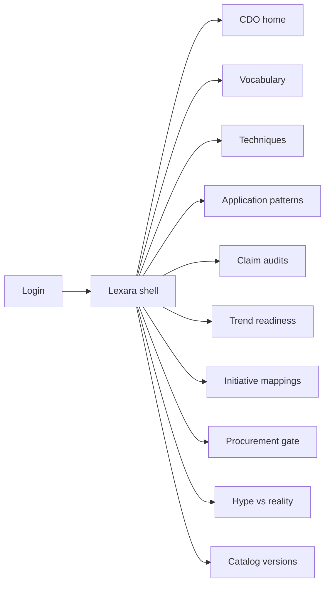
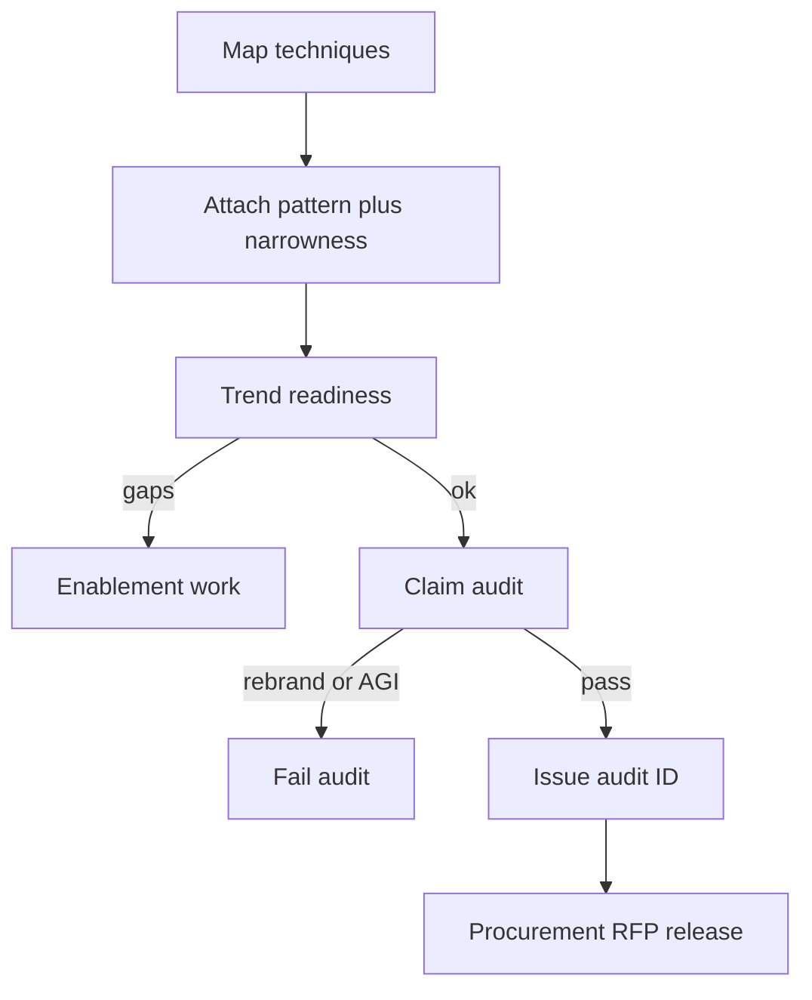

# Lexara — Web app

**Product:** [PRODUCT.md](./PRODUCT.md)
**Primary surface:** CDO / analytics claim-audit console (vocabulary · techniques · hype vs reality)
**Secondary surfaces:** Procurement RFP gate; works-council / ethics pack viewer (technique-scoped job impact)
**Design thesis:** Lexara is a lexicon and claim courtroom for enterprise AI buying — the UI metaphor is a controlled vocabulary desk where every “AI” proposal must map to named techniques and survive classification as rebrand, narrow technique, or evidence-backed before money moves. Visual language is library-ink on cool parchment-dark slate with evidence-green for passed audits, rebrand-amber for vendor theatre, and general-intelligence coral for magical narratives that fail on sight. The brand wordmark anchors every audit and committee report so Northern European buyers know definitional clarity is the product, not another model zoo.

## UX research synthesis

### Category peers (best-in-class)

- **Gartner Peer Insights / Forrester Wave buyer guides (digital UX):** Claim scrutiny and category definitions before spend. Steal: rebrand vs substance framing; reject paywalled analyst density as the daily operator UI.
- **Credo AI / Holistic AI model governance (documentation facets):** Technique and purpose declarations before deployment. Steal: mandatory technique mapping; reject full MLOps runtime where Lexara stops at investment literacy.
- **ServiceNow Vendor Manager Workspace / Coupa sourcing gates:** RFP blocked without prerequisite artifacts. Steal: no AI RFP without passed audit ID; reject generic vendor scorecards that ignore definitional mess.
- **Atlassian Compass / Backstage catalog (lite):** Versioned controlled vocabulary and owned entities. Steal: catalog versioning so historical audits stay interpretable; reject software-component catalog aesthetics for business sponsors.

### Patterns to adopt / reject

- **Adopt:** Plain-language + formal term pairs; technique inventory mandatory on initiatives; claim classes (rebrand / narrow / evidence-backed); trend readiness (cloud AaaS, unstructured data, APIs); general-intelligence auto-fail; enablement gaps as work not silent risk; quarterly hype-vs-reality report.
- **Reject:** Chatbot = “we have AI”; purple hype curve marketing as home; funding without technique map; AlphaGo-transfer expectations; SharePoint glossary as system of record.

### Trust, density, and workflow constraints from PRODUCT.md

Vendor audit notes are restricted; public vocabulary can publish. Unstructured training data flags privacy review (BR-7 adjacent). Works-council packs need technique-scoped job impact, not hype (BR-9). Procurement hard-gates on audit ID (BR-8). Density is committee-grade for CDO; sponsors get plain-language beside use cases; architects get API-first commoditisation hints.

## Information architecture

### Nav model

### Roles → default home

| Role | Default home | Why |
|------|--------------|-----|
| CDO / Head of Analytics | CDO home — audit pass rate + rebrand rate | Investment literacy (BR-12) |
| Enterprise architect | Techniques + readiness | API-first and narrowness (BR-4, BR-5) |
| Procurement | RFP gate | Audit ID required (BR-8) |
| LOB sponsor | Initiative mapping + plain terms | Defend without jargon theatre |
| Risk / people partner | Ethics / works-council packs | Technique-scoped impact (BR-9) |
| Catalog steward | Vocabulary + catalog versions | Controlled definitions (BR-1, BR-10) |

### Cross-links to OpenAPI resources

| Nav area | OpenAPI tags / resources |
|----------|---------------------------|
| Terms / definitions | Vocabulary |
| Technique inventory | Techniques |
| Application patterns | Patterns |
| Vendor claim audits | Claim Audits |
| Cloud / data / API readiness | Readiness |
| Initiative technique maps | Mappings |
| Hype vs reality reports | Reporting |
| Catalog versions, audit entries | Governance |

## Screen inventory

### CDO home

- **Purpose:** Answer “are we funding techniques — or rebranded mining demos?” in one composition.
- **Entry:** CDO post-login.
- **Layout regions:** Brand + quarter; strip (audit pass rate, rebrand rate into portfolio, trend-gap count, general-intelligence fails); open audits; enablement backlog; committee pack CTA.
- **Primary actions:** Open failing claim; publish hype-vs-reality report; freeze RFP without audit.
- **Empty / loading / error:** Empty = publish first vocabulary version + technique seed; loading = skeleton strip; error = retry with request id.
- **BR / story ties:** BR-3, BR-12; CDO stories.

### Controlled vocabulary

- **Purpose:** AI, ML, cognitive analytics and related terms with plain-language and formal definitions.
- **Entry:** Steward / Vocab nav; sponsor side panel.
- **Layout regions:** Term list; plain vs formal panes; version badge; related techniques.
- **Primary actions:** Edit term; publish version; deprecate synonym abuse.
- **Empty / loading / error:** Undefined term in proposal = amber link-to-define.
- **BR / story ties:** BR-1, BR-10.

### Technique inventory

- **Purpose:** Approved techniques (supervised/unsupervised/RL, NLP-NER/POS/parsing, neural nets, MDP-style, etc.) with training-data prerequisites.
- **Entry:** Architect / Techniques.
- **Layout regions:** Technique cards; example-volume risks; commoditised API-first flag; narrowness notes.
- **Primary actions:** Add technique; flag AAAAS/API option; set data prerequisites.
- **Empty / loading / error:** Initiative without technique = cannot submit audit.
- **BR / story ties:** BR-2, BR-7; architect stories.

### Application pattern library

- **Purpose:** Patterns (claims text+image, energy optimisation, clinical alerts, conversational, solvers/games) with stated narrowness and non-transfer assumptions.
- **Entry:** Patterns nav; sponsor templates.
- **Layout regions:** Pattern catalog; narrowness warning; non-transfer banner; linked techniques.
- **Primary actions:** Attach pattern to initiative; acknowledge non-transfer.
- **Empty / loading / error:** AlphaGo-class without narrowness = coral fail path (BR-6).
- **BR / story ties:** BR-4, BR-6.

### Vendor claim audit

- **Purpose:** Classify claims as rebrand, narrow technique, or evidence-backed; retain history.
- **Entry:** Audits nav; proposal intake.
- **Layout regions:** Claim text; vendor; prior classifications; classifier controls; evidence attachments; outcome ID.
- **Primary actions:** Classify; request evidence; fail general-intelligence narrative; issue audit ID.
- **Empty / loading / error:** Empty queue = healthy; incomplete evidence = cannot pass.
- **BR / story ties:** BR-3, BR-6, BR-8; procurement stories.

### Trend readiness scoring

- **Purpose:** Score cloud/AaaS, unstructured data readiness, API leverage before build-vs-buy.
- **Entry:** Readiness nav; mapping workflow.
- **Layout regions:** Three trend meters; gap list; enablement epic links; build-vs-buy recommendation.
- **Primary actions:** Rescore; open enablement gap; prefer API-first when commoditised.
- **Empty / loading / error:** Low readiness = gate with enablement, not silent risk.
- **BR / story ties:** BR-5, BR-11.

### Initiative technique mapping

- **Purpose:** Every proposal maps to techniques + patterns + readiness before funding path.
- **Entry:** Sponsor / Mappings.
- **Layout regions:** Initiative header; technique chips; pattern; claim audit link; plain-language term panel.
- **Primary actions:** Submit to audit; revise map; view examples (claims, energy, clinical).
- **Empty / loading / error:** Missing map = blocked submit.
- **BR / story ties:** BR-2, BR-4; sponsor stories.

### Procurement RFP gate

- **Purpose:** Block AI RFP advance without passed claim audit ID.
- **Entry:** Procurement default; PPM integration.
- **Layout regions:** RFP list; audit ID field; vendor rebrand history; release control.
- **Primary actions:** Attach audit; release RFP; reject.
- **Empty / loading / error:** No audit ID = hard block with link to start audit.
- **BR / story ties:** BR-8.

### Enablement gap tracker

- **Purpose:** Leapfrog gaps become explicit work (API enablement, lake quality), not buried risk.
- **Entry:** Readiness → Gaps; architect backlog.
- **Layout regions:** Gap queue; owner; linked initiatives; closure evidence.
- **Primary actions:** Create epic; close gap; re-score readiness.
- **Empty / loading / error:** Empty = trends healthy message.
- **BR / story ties:** BR-11.

### Works-council / ethics pack

- **Purpose:** Job-impact language grounded in technique scope, not hype.
- **Entry:** Risk / people partner.
- **Layout regions:** Initiative scope; technique limits; impact narrative builder; export.
- **Primary actions:** Generate pack; approve language; attach to committee.
- **Empty / loading / error:** Hype adjectives without technique = reject copy.
- **BR / story ties:** BR-9.

### Hype vs reality report

- **Purpose:** Quarterly rebrand rate and audit pass rate for investment committee.
- **Entry:** CDO → Report; board export.
- **Layout regions:** Rebrand vs evidence-backed chart; pass rate trend; override log; PDF/CSV.
- **Primary actions:** Publish quarter; lock; present.
- **Empty / loading / error:** Incomplete quarter = draft watermark.
- **BR / story ties:** BR-12.

### Catalog version governance

- **Purpose:** Version vocabulary/techniques so historical audits remain interpretable.
- **Entry:** Governance → Versions.
- **Layout regions:** Version timeline; diff; approve publish; pin audits to version.
- **Primary actions:** Publish version; compare; freeze.
- **Empty / loading / error:** Unversioned edit in prod = blocked.
- **BR / story ties:** BR-10.

## Key flows

1. **Proposal to fundable claim** — map techniques → pattern + narrowness → readiness score → claim audit → audit ID → RFP/funding; failure: rebrand or AGI narrative fails.

2. **Vendor rebrand catch** — proposal language → compare to prior analytics → classify rebrand → retain on vendor record.

3. **API-first commoditisation** — technique flagged commoditised → surface AaaS/API options → prefer buy/call over rebuild.

4. **Works-council pack** — technique scope → impact narrative → export without hype adjectives.

5. **Quarterly committee** — aggregate audits → rebrand rate + pass rate → publish hype-vs-reality pack.

## Design system

### Tokens (CSS variables)

- `--color-ink: #EDE6DC` — text
- `--color-lexicon-950: #12141A` — ground
- `--color-lexicon-900: #1A1E28` — panels
- `--color-lexicon-700: #3A4150` — rules
- `--color-evidence: #4FAE7A` — evidence-backed / audit pass
- `--color-rebrand: #D4A017` — rebrand classification
- `--color-agi-fail: #D94F45` — general-intelligence narrative fail
- `--color-steel: #9AA3B2` — secondary / claimed-narrow
- `--color-brand: #C4B5A0` — Lexara wordmark (library linen, not cream-serif brochure kit)
- `--font-display: "Literata", serif` — term titles only (expressive, paired)
- `--font-body: "Figtree", sans-serif` — UI body (not Inter/Roboto/Arial/system as hero stack)
- `--font-mono: "IBM Plex Mono", monospace` — audit ids, catalog versions
- `--space-1`…`--space-8`: 4px scale
- `--radius-sm: 4px`; `--radius-md: 8px`
- `--motion-stamp: 200ms ease-out` — audit pass stamp
- `--motion-rebrand: 240ms ease-in-out` — amber classify pulse
- Atmosphere: faint folio margin lines on lexicon-900; stamp motif on passed audits; no purple hype-curve neon; avoid broadsheet dense columns.

### Typography & brand

- Literata for vocabulary headwords; Figtree for chrome and body; mono for audit IDs.
- Brand on audit and committee report; login: “Name the technique. Then fund.”; one CTA — no AlphaGo hero collage.

### Do / don’t

- **Do:** Force technique maps; classify rebrands; fail AGI narratives; gate RFPs on audit ID; version the catalog; show enablement gaps.
- **Don’t:** Treat chatbot demos as portfolio proof; purple AI; silent SharePoint glossaries; transfer myths; card grids of buzzword pillars.

### Accessibility & domain trust cues

- AA+ contrast; claim class uses label + colour.
- Live regions for audit outcomes and RFP blocks.
- Focus: vocabulary → map → audit → RFP → report.
- Historical audits pinned to catalog version for interpretability.

## Component patterns

- **TermPlainFormalPair** — dual definition panes.
- **TechniqueMapChips** — mandatory inventory tags on initiatives.
- **ClaimClassStamp** — rebrand / narrow / evidence-backed.
- **NarrownessBanner** — non-transfer assumption.
- **TrendReadinessMeters** — cloud / unstructured / API.
- **AuditIdGate** — procurement prerequisite.
- **EnablementGapRow** — leapfrog work item.
- **HypeRealityReport** — quarterly rebrand vs pass rates.

## Out of scope for v1 web

- Model training or inference runtime; full data catalog replacement; consumer chatbot; vendor marketing CMS; native mobile for CDO; multi-tenant public AI encyclopedia.
